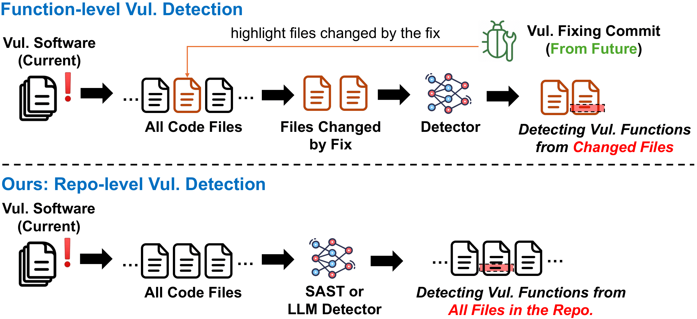

# Detecting Vulnerable Functions from Repositories with LLMs



## Download Replication Package from Zenodo

Due to the large size of the datasets, we upload the replication package to Zenodo, and please refer to the following link to download it first:

https://zenodo.org/records/15587888

```
unzip detect_vul_from_repo.zip
cd detect_vul_from_repo
```

## Fine-tuning lightweight LLMs


### Install Dependencies

```
cd lightweight_LLMs_experments
## This step takes a while to complete
conda env create -n sLLM -f environment.yml 
conda activate sLLM
pip uninstall numpy -y
pip install numpy==1.25.2

```

#### Train and Infer

```
cd sh
bash 01_train_java.sh
bash 01_train_python.sh

bash 02_test_java.sh
bash 02_test_python.sh

```

## Prompting large LLMs

### Install Dependencies
```
## This step takes a while to complete
conda env create -n llm-prompt -f environment.yml 
conda activate llm-prompt
pip install huggingface_hub
huggingface-cli login
<Key in your huggingface access token, otherwise, may not be able to access the LLMs>
```

#### Infer 
```
bash 01_run_zero_shot.sh
bash 02_run_few_shot.sh
bash 03_run_cot.sh
bash 04_run_rag.sh
```


## Parameter-efficient Fine-tuning large LLMs


### Install Dependencies


We used the llama-factory library for experiments of PEFT.
```
cd peft_large_LLMs_experiments
## This step takes a while to complete
conda env create -n peft -f environment.yml 
conda activate peft
```

#### Train and Infer

```
cd experiment_scripts/lora_single_gpu
bash 01_train_java_dscoder.sh
bash 02_test_java_dscoder.sh
bash 01_train_py_dscoder.sh
bash 02_test_py_dscoder.sh
```
Then you can change `dscoder` into `qwen`, `starcoder2`, and `llama` to run experiments with other LLMs.


## SAST Results and Benchmark Data

```
cd sast_tool_results
the results and the repo-level data are saved in  java/, python/ folders
```

```
SAST Tools Version Info:
CodeQL: v2.10.2
Contrast 1.0.10
Horusec v2.8.0
Insider v3.0.0
SBwFSB v1.12.0
Semgrep v0.108.0
SonarQube v9.5.0
Bearer v1.43.0
Badnit v1.7.8
Dlint v0.14.0
DevSkim v1.0.33
Graudit v3.6
```


## Read Results

```
cd ./evaluators
python read_icl_prediction.py
python read_light_llm_prediction.py
python read_peft_prediction.py
python read_sast_prediction_java.py
python read_sast_prediction_py.py
```
